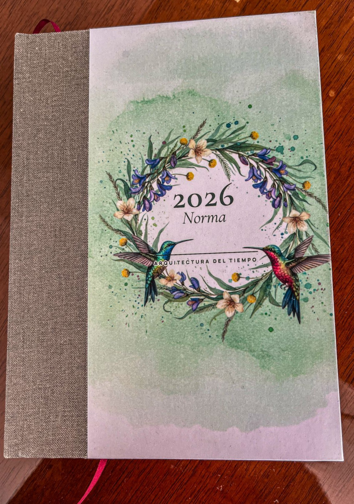
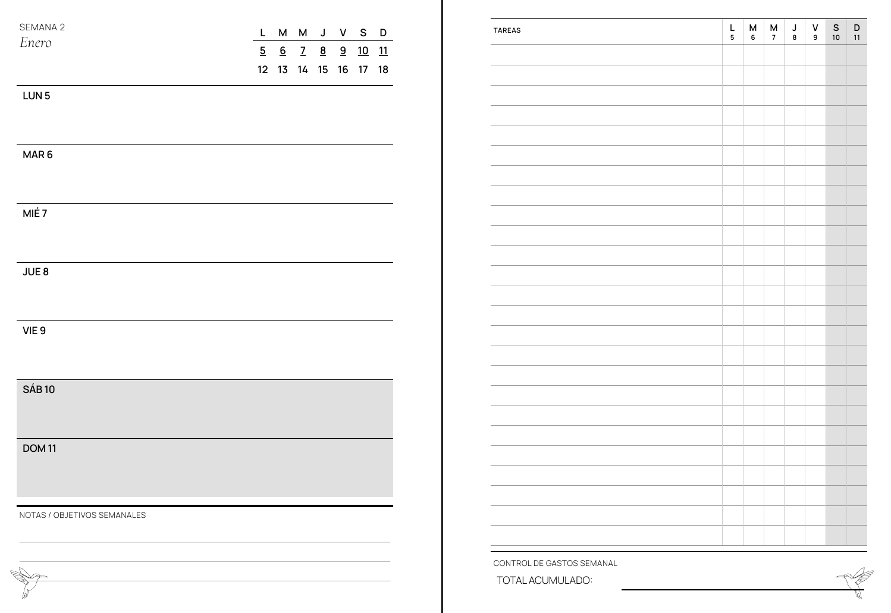
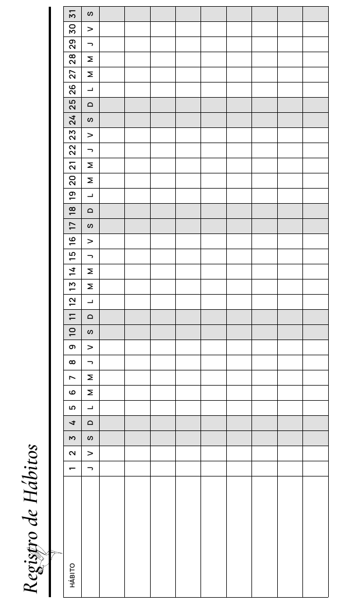

# Generador de Agendas "Heritage" (Python + WeasyPrint)

Motor de ingeniería editorial escrito en Python para generar agendas de alta gama en formato PDF (1200 DPI). Combina la potencia de **Jinja2** y **WeasyPrint** con principios de diseño suizo y encuadernación artesanal.



## 📜 Filosofía de Diseño: El Concepto "Heritage"

La identidad visual **"Heritage"** no debe confundirse con un estilo "vintage" o "retro". No busca la nostalgia kitsch, sino la **atemporalidad**.

**"Heritage" significa Clásico, Durable y Legible.**

El diseño evoca la calidad táctil de los libros botánicos del siglo XIX, fusionada con la precisión funcional de la tipografía moderna. El objetivo es crear un objeto que se sienta relevante hoy y dentro de cien años.

### Pilares Fundamentales

*   **Tipografía Dual:** Una danza cuidadosa entre **Cormorant Garamond** (historia y elegancia para títulos) y **Manrope** (modernidad y legibilidad para datos).
*   **El Lujo del Espacio Negativo:** Márgenes de **20mm** que permiten "respirar" al contenido, facilitando la escritura y la lectura.
*   **Ingeniería de Papel (1200 DPI):**
    *   Líneas **100% vectoriales** de 0.25pt.
    *   Ausencia de grises rasterizados (tramados) para garantizar nitidez extrema en impresoras láser monocromáticas.
    *   Optimizado para papel *Bookcel* (Ahuesado).

---

## ⚙️ Características Funcionales (Behavioral Engineering)

1.  **Método Alastair Híbrido:**
    Una disposición semanal que separa lo rígido (citas con hora) de lo fluido (tareas de la semana). Permite migrar tareas sin reescribirlas.

2.  **Habit Tracker Rotado (Landscape):**
    Aprovecha el eje largo de la página A5 (210mm) para ofrecer celdas de 5.5mm, permitiendo un seguimiento mensual cómodo sin comprimir la caligrafía.

3.  **Zero-Waste Layout:**
    Cada módulo ha sido calculado matemáticamente para encajar estrictamente dentro del formato A5, eliminando páginas fantasma y errores de corte.


## 🚀 Instalación y Uso

Este proyecto requiere **Python 3.10+**.

1.  **Clonar y preparar entorno:**
    ```bash
    git clone https://github.com/jonidimo/agenda-heritage-generator.git
    cd agenda-heritage-generator
    python3 -m venv venv
    source venv/bin/activate
    ```

2.  **Instalar dependencias:**
    ```bash
    pip install -r requirements.txt
    ```
    *(Requiere: weasyprint, jinja2, arrow, holidays)*

3.  **Generar la Agenda:**
    ```bash
    python3 build_agenda_2026.py
    ```
    El archivo PDF listo para imprimir aparecerá en la carpeta `output/`.

---

## 🏗 Estructura del Proyecto

*   `build_agenda_2026.py`: El script maestro que orquesta la generación.
*   `themes/heritage/`: Contiene todos los assets del diseño actual.
    *   `templates/`: Plantillas HTML (Jinja2) modulares.
    *   `css/`: Estilos maestros para impresión.
    *   `assets/`: Vectores (SVG) convertidos a Base64.

---

*Diseñado y Programado en Argentina.*